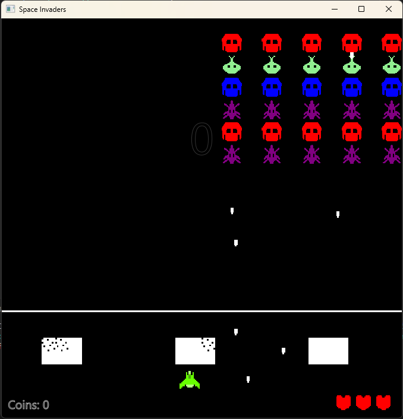

# Team Project

This is the team repo for Sudoku Starfighters where we'll
be working on creating Space Invaders in Java

`Note: JavaSE-17/JavaSE-21 is used for this project. Configure your workspace with this version of Java.`

| Contributors      |
| ----------------- |
| Steven Truong     |
| Thomas Obrenovich |
| Ivan Gusachenko   |
