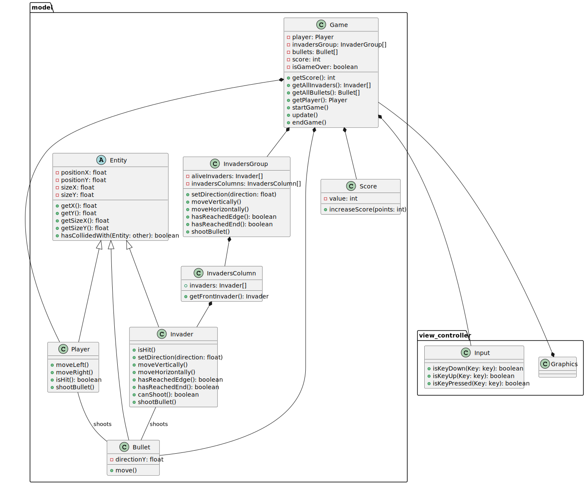

# Class Diagram

Note: Sprites do not need to match the size of the player, bullet, or enemy. Instead, it's probably better to have the player sprite bigger than the player model (to stop unfair hitbox collisions).
