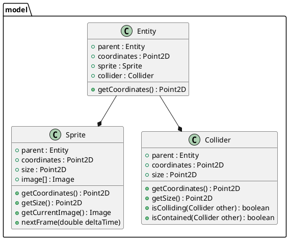

# Class Diagram

```plantuml
@startuml EntityDiagram
package "model" {
  class Entity {
    + parent : Entity
    + coordinates : Point2D
    + sprite : Sprite
    + collider : Collider
    + getCoordinates() : Point2D
  }

  class Sprite {
    + parent : Entity
    + coordinates : Point2D
    + size : Point2D
    + getCoordinates() : Point2D
    + image[] : Image
    + getSize() : Point2D
    + getCurrentImage() : Image
    + nextFrame(double deltaTime)
  }

  class Collider {
    + parent : Entity
    + coordinates : Point2D
    + size : Point2D
    + getCoordinates() : Point2D
    + getSize() : Point2D
    + isColliding(Collider other) : boolean
    + isContained(Collider other) : boolean
  }

  Entity --* Sprite
  Entity --* Collider

}
@enduml
```