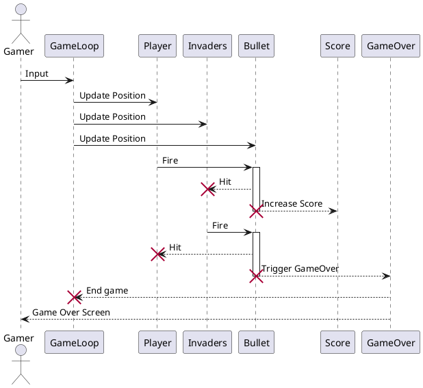

# Sequence Diagram

```plantuml
@startuml SpaceInvadersSequenceDiagram
actor Gamer
participant GameLoop
participant Player
participant Invaders
participant Bullet
participant Score

Gamer -> GameLoop: Input

GameLoop -> Player: Update Position
GameLoop -> Invaders: Update Position
GameLoop -> Bullet: Update Position

Bullet <- Player++: Fire
Bullet --> Invaders!!: Hit
Bullet --> Score--: Increase Score
destroy Bullet

Bullet <- Invaders++: Fire
Bullet --> Player!!: Hit
Bullet --> GameOver--: Trigger GameOver
destroy Bullet

GameLoop <-- GameOver !!: End game
Gamer <-- GameOver: Game Over Screen

@enduml
```